# Exam-system
<b><u>Objective</b></u> 
The online objective exam system is an online test system that allows users to take online tests and automatically generates results based on answers marked by users. 
<b>Users of system</b> 
<ul><li>Admin</li><li>Student</li></ul>
<b>Functional Requirements</b> 
<ul>
<li>Student</li>
1.	Can login and logout.  
2.	Can add their details.  
3.	Can view their names.  
4.	Can delete their information.  
5.	Can update their details.  
6.   Can Search their details.  
</ul>
<b>Tools Used</b> 
1.	cmd and Jdk  
2.	Os:-Windows 8 
3.  Backend:-Mysql 
4.  Front End:-Jsp  
5.  Database Connectivity:-JDBC 
   
<b>Working of Project with Screenshots</b> 
First page:- There is a home page in which you have to login as a admin or as a student  
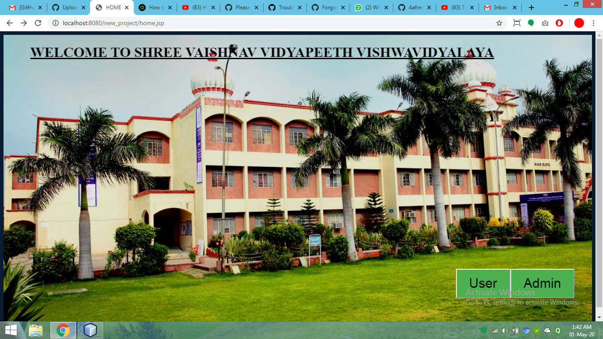 
After login as user if you have already account than login as a student otherwise fill the registration form first. 
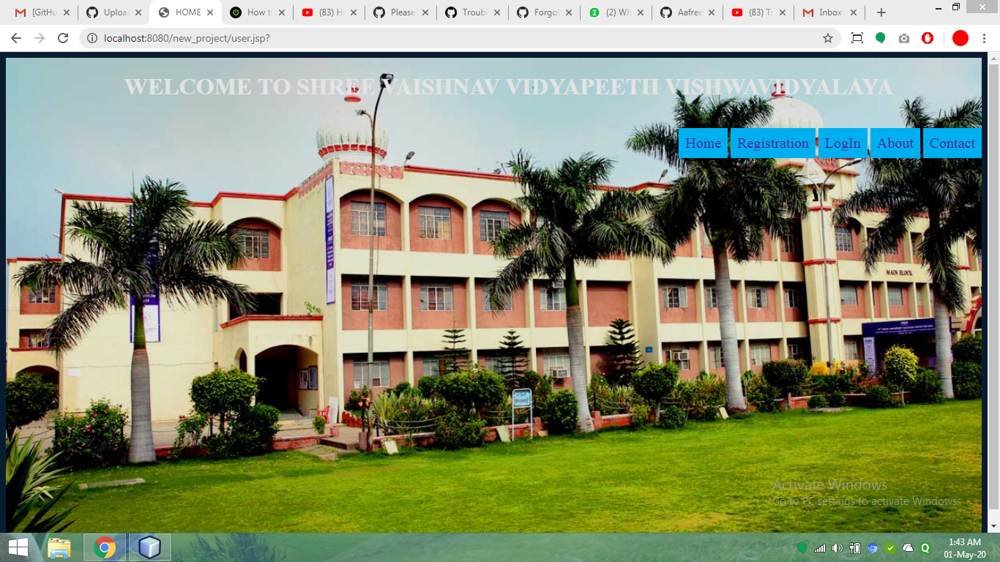 
image for Registration page
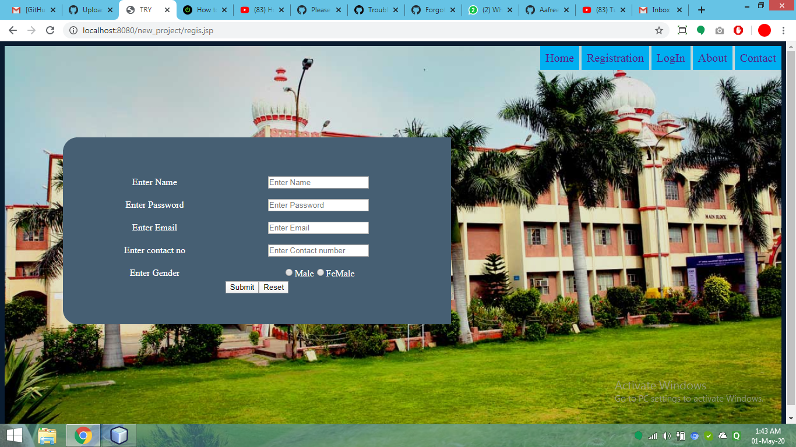 
image for login page 
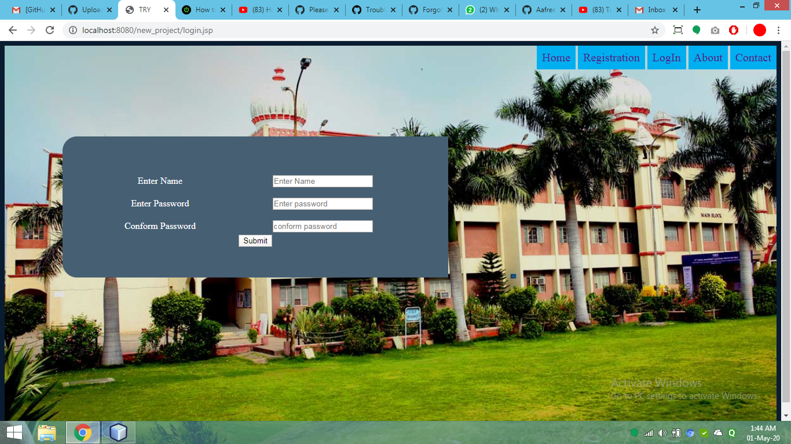 
if the login details of student is correct than fill the exam registration form 
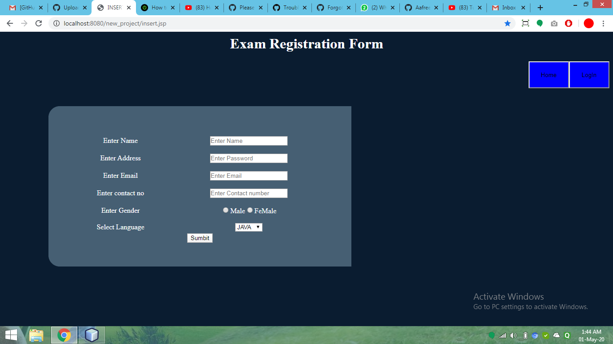 

student can also delete their details also 
 
student can also Update their details also 
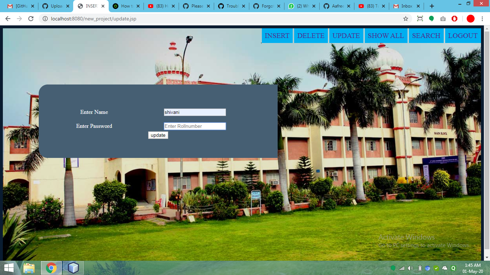 
student can also search their details also 
 
After searching details are 
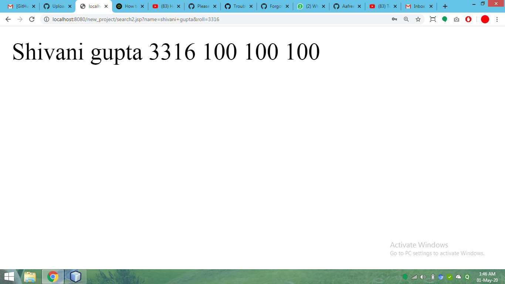 
student can see details of all students 
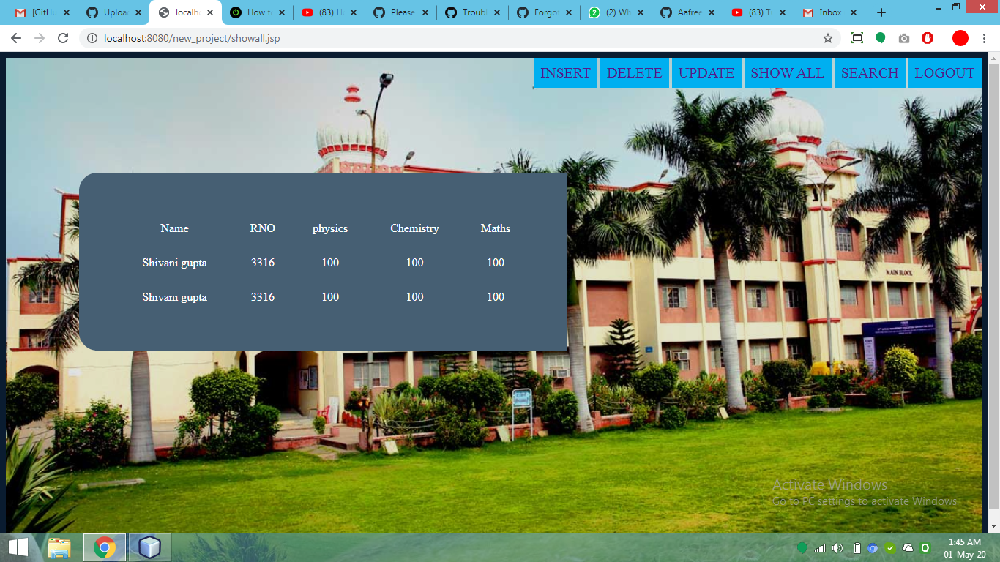 

if you login successfully 

click on option"are you ready for exam" 
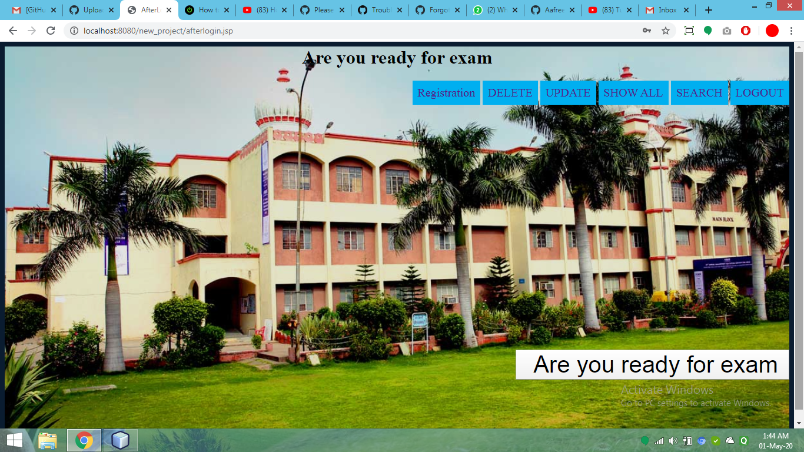 
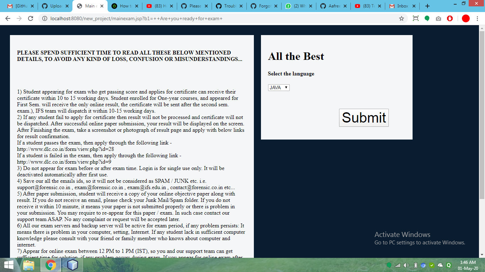 
select your language and click on submit 
than exam will be started and questions are display 
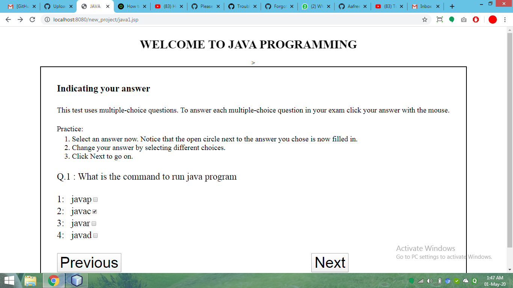 
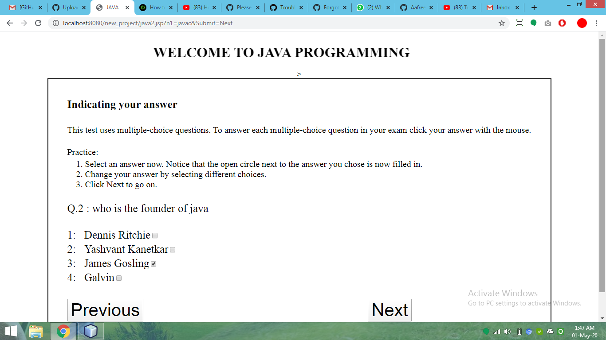 
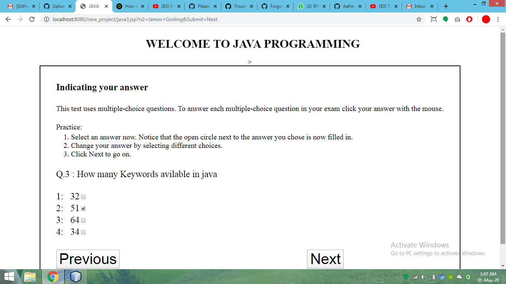 
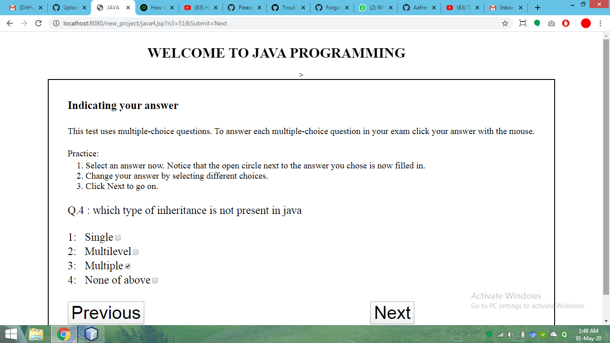 
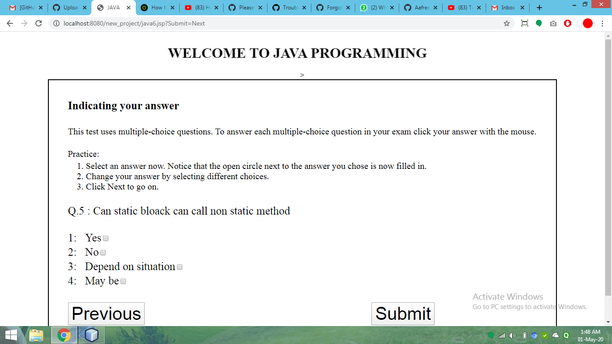 
now on clicking on submit button result will be show 
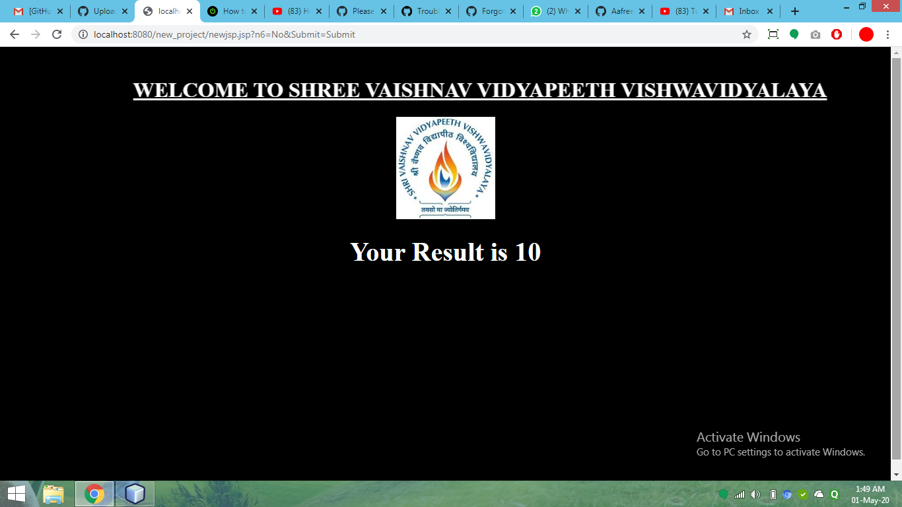 

<b>Class Diagram</b> 
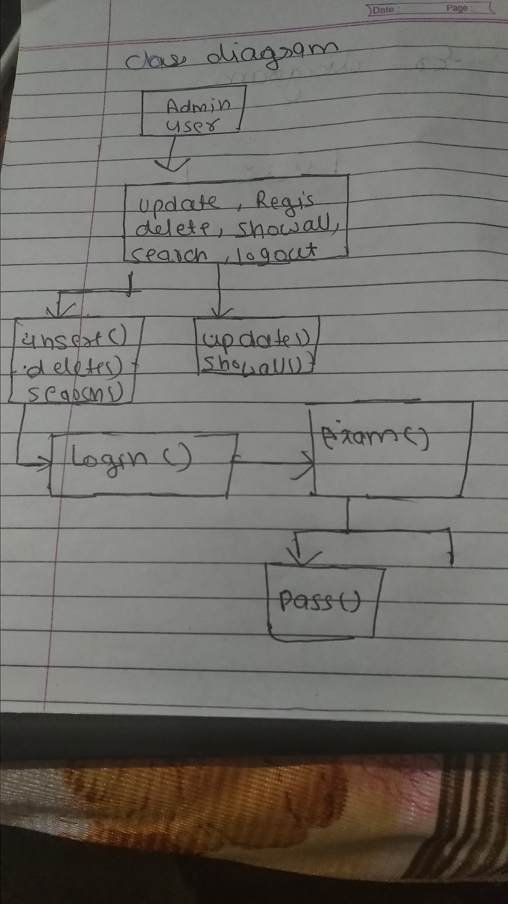 

<b>ER Diagram</b> 
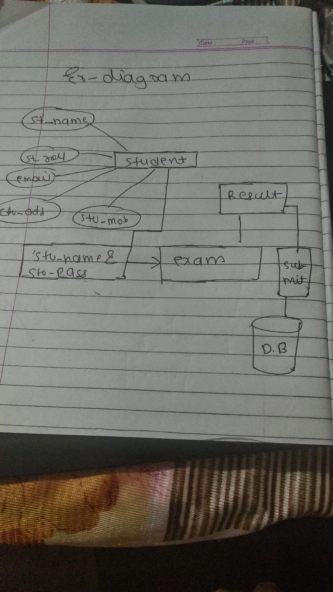 
